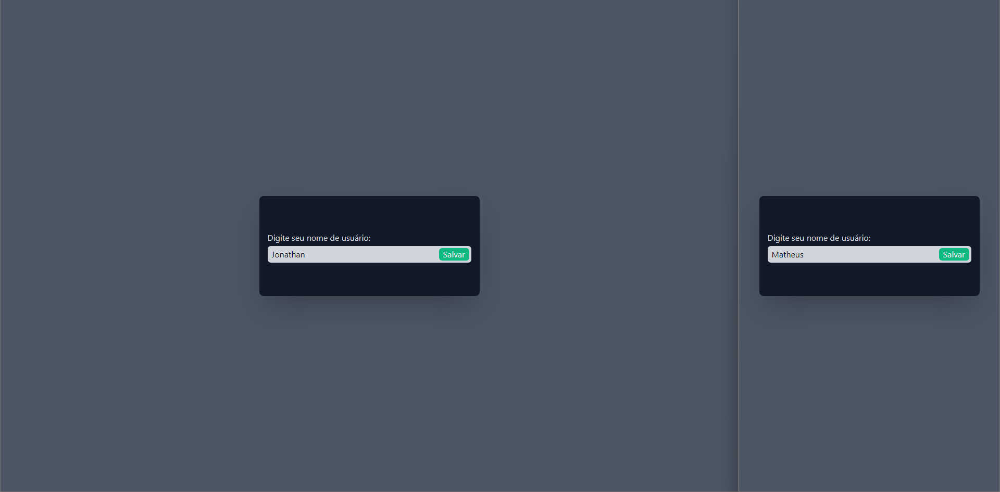
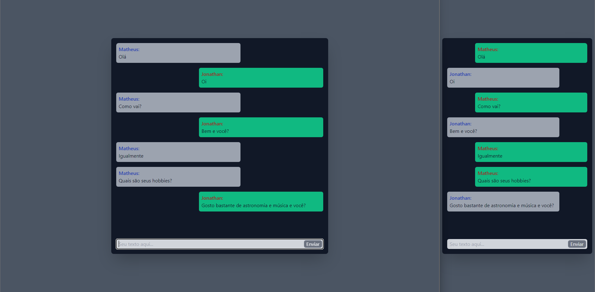

## Friending

**Accessible project link: <a href="https://friending.onrender.com/">Friending</a>**

## Summary

1. [What it is](#what-it-is)
2. [Running the application locally](#running-the-application-locally)

## What it is

The program is a real-time chat application using WebSockets. It is a chat without authentication, so everyone can use it easily, with the aim of meeting random people and making friends, just enter the user name and use it.

> Program developed in my native language (Portuguese).

### Technologies and libraries used :

- HTML, CSS, JavaScript
- Tailwind CSS
- Node.js
- Express
- socket.io

## Running the application locally

1. First, make sure you have <a href="https://nodejs.org/en">Node.js</a> installed on your machine.

   > Program developed in version 18.12.1 on Node.js.

2. Then run the “start.bat” file in the root directory.

### Preview :

<table width="100%"> 
<tr>
<td width="100%">

</td> 
</tr>
<tr>
<td width="100%">

</td> 
</tr>
</table>
